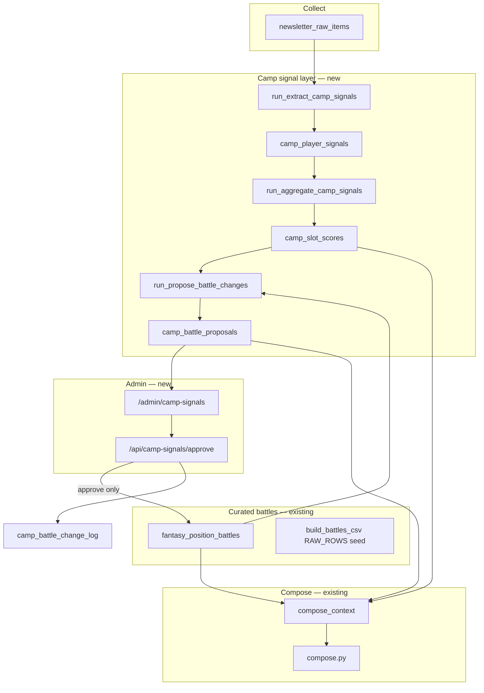

# Camp Signal Layer — Design

Track camp/season player momentum from collected news, aggregate it against curated position battles, and **propose** depth-chart updates. **Nothing writes to `fantasy_position_battles` without editor approval.**

---

## Problem

Today:

| Layer | Updates automatically? |
|-------|------------------------|
| `fantasy_team_depth` (WR1/WR2 order) | No — DraftDNA / manual |
| `fantasy_position_battles` (settled vs contested) | No — `build_battles_csv.py` editorial seed → sync |
| Daily newsletter copy | Yes — when sources mention a player that day |

Gaps:

- Camp standouts mentioned on Tuesday are not accumulated by Friday.
- No alert when reporting consistently favors one battle candidate.
- No proposed change queue before you lock a slot as `settled`.

This design adds a **signal layer** between collect and compose, plus an **approval gate** before battle rows change.

---

## Goals

1. **Extract** structured up/down/neutral signals for battle candidates from raw items.
2. **Aggregate** signals over a rolling window (default 7 days) per `(team, slot, player)`.
3. **Propose** battle changes when thresholds are met — never auto-apply.
4. **Approve** via admin UI; on approve, upsert `fantasy_position_battles` and log audit trail.
5. **Inform compose** with signal summaries so daily copy reflects momentum even before you approve a settle.

Non-goals (v1):

- Auto-updating `fantasy_team_depth` WR order (separate, higher-stakes change type — v2).
- Replacing human editorial judgment on ambiguous two-way fights.
- Twitter/X ingest (deferred elsewhere in product spec).

---

## Architecture



**Insertion point:** `run_extract_camp_signals` runs after collect (and optionally after media batch), before compose. Wired into `scripts/daily_collect.ps1` between collect and compose.

```powershell
# daily_collect.ps1 (future)
.\scripts\collect.ps1
.\scripts\extract_camp_signals.ps1   # new
.\scripts\compose.ps1
```

---

## Data model

Migration: `016_camp_signal_layer.sql`

### 1. `camp_player_signals` — atomic observations

One row per player mention with directional camp context in a raw item.

| Column | Type | Notes |
|--------|------|-------|
| `id` | uuid PK | |
| `content_date` | date | PT content date (matches raw item) |
| `team_abbr` | text | BAL, PIT, … |
| `position` | text | QB, RB, WR, TE |
| `slot` | text | WR2, RB2, … — matched to `fantasy_position_battles` |
| `player_name` | text | Canonical name from roster registry |
| `direction` | text | `up` \| `down` \| `neutral` |
| `strength` | smallint | 1 = passing mention, 2 = positive/negative lean, 3 = standout / clear setback |
| `signal_type` | text | `camp_rep`, `coach_quote`, `beat_report`, `practice_snap`, `injury`, `rumor`, `projection` |
| `summary` | text | One sentence for admin UI |
| `raw_item_id` | uuid FK | → `newsletter_raw_items` |
| `source_url` | text | |
| `source_tier` | smallint | 1 = best (club/beat tier 1–2), 5 = weakest (fan Reddit) |
| `extracted_at` | timestamptz | |
| `metadata` | jsonb | model version, confidence, alternate names |

Unique: `(raw_item_id, player_name, slot)` — idempotent re-runs.

### 2. `camp_slot_scores` — rolling aggregates

Rebuilt nightly (or after each extract). One row per `(team_abbr, slot, player_name)` for the active window.

| Column | Type | Notes |
|--------|------|-------|
| `season` | smallint | 2026 |
| `team_abbr`, `position`, `slot`, `player_name` | | PK composite |
| `window_days` | smallint | Default 7 |
| `score` | numeric | Weighted sum (see formula below) |
| `signal_count` | int | |
| `up_count`, `down_count` | int | |
| `last_signal_at` | timestamptz | |
| `trend` | text | `rising` \| `falling` \| `flat` — compare recent half vs older half of window |
| `top_source_tier` | smallint | Best tier in window |
| `updated_at` | timestamptz | |

### 3. `camp_battle_proposals` — pending editor decisions

| Column | Type | Notes |
|--------|------|-------|
| `id` | uuid PK | |
| `season` | smallint | |
| `team_abbr`, `position`, `slot` | | Target battle |
| `proposal_type` | text | See types below |
| `status` | text | `pending` \| `approved` \| `rejected` \| `expired` |
| `current_state` | jsonb | Snapshot of row from `fantasy_position_battles` |
| `proposed_state` | jsonb | Full proposed row: `status`, `candidates[]`, `note` |
| `rationale` | text | Human-readable: "Lane +11.5 over 7d, 4 up signals, 2 tier-1/2 sources" |
| `evidence` | jsonb | Top 5 signals + scores that triggered proposal |
| `confidence` | text | `low` \| `medium` \| `high` |
| `created_at` | timestamptz | |
| `resolved_at` | timestamptz | |
| `resolved_by` | text | Optional editor id / "admin" |
| `reject_reason` | text | |

**Proposal types (v1):**

| Type | Example |
|------|---------|
| `settle_slot` | Lane → `settled` WR2, single candidate |
| `strengthen_lean` | Reorder `candidates` or update `note` ("Lane lean" → "Lane clear WR2") |
| `widen_battle` | Add candidate to `contested` row |
| `narrow_battle` | Remove fading candidate |
| `reopen_slot` | `settled` → `contested` when starter loses ground (injury/down signals) |

**Dedup:** At most one `pending` proposal per `(season, team_abbr, slot, proposal_type)`. New evidence updates `evidence` + `rationale` on existing pending row instead of spamming duplicates.

### 4. `camp_battle_change_log` — audit trail

Append-only record of approved changes (for rollback and newsletter accountability).

| Column | Type |
|--------|------|
| `id` | uuid |
| `proposal_id` | uuid |
| `season`, `team_abbr`, `position`, `slot` | |
| `before` / `after` | jsonb |
| `approved_at` | timestamptz |
| `approved_by` | text |

---

## Signal extraction

**Module:** `pipeline/src/extract_camp_signals.py`  
**Runner:** `pipeline/src/run_extract_camp_signals.py`  
**Script:** `scripts/extract_camp_signals.ps1`

### Step 1 — Candidate pool

For each team, load from Supabase:

- `fantasy_position_battles` where `status IN ('contested', 'open')` → all `candidates[]`
- Optionally `settled` rows too (to detect reopen signals) — v1.1

Build a per-team player → `(position, slot)` map. Only extract signals for names in the battle pool (avoids hallucinated players).

### Step 2 — Filter raw items

Select `newsletter_raw_items` for `content_date` (or last N days on backfill) where:

- `team_ids` includes the team, OR body matches team keywords
- Body/title matches camp keywords: `camp`, `practice`, `OTA`, `minicamp`, `training camp`, `depth chart`, `standout`, `rep`, `first-team`, `snap`, `bubble`, `roster`, etc.
- Skip items already processed (check `camp_player_signals.raw_item_id`)

### Step 3 — LLM extraction (batch per team)

Use a **light** Claude prompt (Haiku or Sonnet, low max_tokens) — not full compose.

Input per batch:

```json
{
  "team_abbr": "BAL",
  "battles": [
    {
      "slot": "WR2",
      "status": "contested",
      "candidates": ["Ja'Kobi Lane", "Rashod Bateman", "Elijah Sarratt"]
    }
  ],
  "items": [
    { "id": "...", "title": "...", "body": "...", "source_tier": 2, "url": "..." }
  ]
}
```

Output schema:

```json
{
  "signals": [
    {
      "raw_item_id": "...",
      "player_name": "Ja'Kobi Lane",
      "slot": "WR2",
      "direction": "up",
      "strength": 3,
      "signal_type": "beat_report",
      "summary": "Beat writer: Lane took majority of first-team WR reps outside Zay Flowers."
    }
  ]
}
```

Rules for the model:

- Only emit signals for listed candidates.
- `rumor` / Reddit-only → max strength 2 unless multiple items agree.
- Injury setback → `down`, `signal_type: injury`.
- Pundit/analyst prediction of who wins a battle (no reported practice event) →
  `signal_type: projection`, strength always 1 — see "Predictive/speculative signals" below.
- No signal if mention is generic team camp recap with no player-specific direction.

Validate player names against `rosters_2026` / `fantasy_team_depth` (same as `build_battles_csv --validate`).

### Step 4 — Upsert

Insert into `camp_player_signals` with idempotent unique key.

---

## Scoring & aggregation

**Module:** `pipeline/src/aggregate_camp_signals.py` · shared helpers in `pipeline/src/camp_signals_common.py`

**Learned the hard way (real example, DEN RB1):** early on, Jonah Coleman picked up a
high-confidence `settle_slot` proposal off 5 "up" signals over a week. All 5 turned out
to be the *same* Sean Payton offseason-fitness story getting re-collected on 5 different
days (RSS/Reddit resyndication) — none of them said anything about reps, depth chart, or
beating out Dobbins/Harvey. Volume of positive mentions was getting confused with actual
evidence that he's winning the job. Two fixes below address this directly.

### Per-signal weight

```
weight = direction_sign * strength * tier_multiplier * signal_type_multiplier

direction_sign: up = +1, down = -1, neutral = 0
tier_multiplier: tier 1 → 1.5, tier 2 → 1.25, tier 3 → 1.0, tier 4 → 0.75, tier 5 → 0.5
signal_type_multiplier: coach_quote → 1.5, beat_report → 1.25, practice_snap → 1.1,
                         injury → 1.25, camp_rep → 0.8, rumor → 0.5, projection → 0.8
```

Signal type now matters, not just source tier — a coach naming a starter or a beat
writer describing rep distribution outweighs a generic "he looked good in camp" mention,
even from the same outlet. The extraction prompt (`extract_camp_signals.py`) was also
tightened: strength 2–3 requires content that speaks *directly* to the battle outcome
(first-team reps, snap counts, depth-chart order, a coach naming a leader, beating out a
named rival). Generic offseason hype/conditioning praise is capped at strength 1 even if
the source is great, because being praised isn't the same as winning reps.

Rumor-type signals cap at strength 2 unless corroborated by multiple concrete practice
details.

### Predictive/speculative signals

Leading into minicamp there's a lot of pundit/analyst speculation about who *will* win a
battle, as distinct from reports of who's *actually* winning reps. That speculation is
legitimate to track — it's often directionally right and it's what fans are reading — but
it should never outweigh or look-alike as observed camp evidence.

**Real example (CLE WR1):** KC Concepcion picked up a high-confidence `settle_slot`
proposal (+23.1 gap over Jerry Jeudy) built on 5 "up" signals, all tagged `beat_report`.
None of them described a practice, a rep count, or a coach's decision — they were 5
distinct pre-camp articles/podcasts predicting Concepcion would emerge as the lead
receiver, based on his draft slot. Because they were independent write-ups (not the same
story resyndicated), duplicate-story collapsing didn't catch this one; they were tagged as
the wrong signal_type instead of being over-counted copies.

**Fix:** predictions/projections get their own `signal_type: "projection"`
(multiplier 0.8, same tier as `camp_rep`) and `strength` is hard-capped at 1 — enforced in
`signal_weight()` itself, not just requested via the extraction prompt, so it holds even
for rows that get manually re-tagged later. After re-tagging those 5 rows, Concepcion's
score dropped from +15.6 to +5.0 and the proposal downgraded from a high-confidence
`settle_slot` to a medium-confidence `strengthen_lean` — still counted, still visible, just
no longer overstating certainty that hasn't been earned by actual camp reps yet.

### Duplicate-story collapsing

Before scoring, signals for the same `(team, slot, player)` are grouped by fuzzy summary
match (`group_duplicate_signals`, threshold 78 on `thefuzz.token_set_ratio`) so that one
underlying story getting republished/resyndicated across multiple days doesn't score like
N independent confirmations. The strongest instance in a group counts at full weight;
every other near-duplicate in that group counts at 20% weight as a small corroboration
bonus (`DUPLICATE_CORROBORATION_FACTOR`). `signal_count`/`up_count`/`down_count` on
`camp_slot_scores` — and the evidence-count thresholds in the proposal engine — are all
**unique-story counts after this collapsing**, not raw row counts. The admin UI's evidence
list shows a "(N× reported)" tag when a story was seen multiple times, so repetition is
visible rather than silently inflating the score.

### Slot score

Sum deduped group weights for `(team, slot, player)` over the window (default 7 days).

### Trend

Split window in half by the representative signal's `content_date` per story group:

- `rising`: second-half score ≥ first-half + 2
- `falling`: second-half ≤ first-half − 2
- else `flat`

Rebuild `camp_slot_scores` after each extract run.

---

## Proposal engine

**Module:** `pipeline/src/propose_battle_changes.py`

Conservative thresholds — prefer **medium/high confidence proposals** over noisy auto-suggestions.

### `settle_slot` (highest bar)

Propose when **all** of:

1. Current `status` is `contested` or `open`.
2. Leader's `score` ≥ **+8** over 7 days.
3. Gap to second candidate ≥ **+5**.
4. Leader has `trend` = `rising` or `flat` (not falling).
5. At least **2** signals with `source_tier` ≤ 2, **or** ≥ 4 signals with `strength` ≥ 2.
6. No other candidate has positive score > +3 in same window.

Proposed state:

```json
{
  "status": "settled",
  "candidates": ["Ja'Kobi Lane"],
  "note": "Camp signals: Lane solidified WR2 (approved YYYY-MM-DD)"
}
```

### `strengthen_lean`

When `contested`, leader score ≥ +4, gap to #2 ≥ +3, but settle thresholds not met:

- Reorder `candidates` by score descending.
- Update `note`: append signal-based lean, e.g. `"Lane lean (4↑ signals, 7d)"`.

### `narrow_battle`

Candidate `score` ≤ −4 and `trend` = `falling` for 5+ days → propose removing from `candidates[]` (never remove last two).

### `reopen_slot`

`settled` slot: incumbent `score` ≤ −6 with injury/down signals → propose `contested` with backup candidates from depth.

### Confidence

| Level | Criteria |
|-------|----------|
| `high` | settle thresholds + 3+ tier-1/2 signals |
| `medium` | strengthen_lean or settle with 2 tier-1/2 |
| `low` | everything else — still shown, but UI warns |

Expired: `pending` proposals older than 14 days without new supporting signals → `expired`.

---

## Weekly approval workflow (superseded — see below)

Original plan below is kept for context; **what shipped is simpler**: the proposal
engine runs nightly (it's pure scoring math, no LLM cost either way) and refreshes
one always-current queue at `/admin/camp-signals`. There is no separate weekly
batch view and no email/Slack digest — you check the admin page whenever you want
(daily during camp, less often once slots settle). Nothing is pushed to you; this
was a deliberate choice over building email delivery (Resend isn't configured yet).

1. ~~After Sunday's last collect + Monday weekly compose, `run_propose_battle_changes` builds one queue for the past 7 days.~~ → runs every night instead.
2. ~~You open `/admin/camp-signals/weekly`~~ → same page as Phase 1, `/admin/camp-signals`, now with a "Pending proposals" section above "Battles of note".
3. Each row: current vs proposed state, evidence (top signals with sources), confidence badge. ✅ shipped as-is.
4. ~~Bulk actions~~ → per-proposal Approve / Reject / Snooze (3d) buttons. Bulk actions not built (queue is short enough in practice; revisit if it gets noisy).
5. Approved rows update `fantasy_position_battles` immediately; next compose run sees the new map. ✅ shipped as-is.

**Expiry:** instead of a fixed 14-day timer, every nightly run re-evaluates every
battle from scratch. A pending proposal whose thresholds no longer hold (momentum
reversed, gap closed) is marked `expired` automatically instead of waiting on a clock.

**Not built (deferred):** `widen_battle` proposals (extraction only tracks players
already in a battle's `candidates[]`, so it can never surface a brand-new name —
would need a separate, riskier "detect new player" extraction pass) and cascade-on-settle
to related lower slots (still manual, same as before signals existed).

---

## Approval workflow

Mirrors rumor review: **flags + panel + API route**.

### Admin routes

| Route | Purpose |
|-------|---------|
| `/admin/camp-signals` | Global queue: all `pending` proposals, filter by team/confidence |
| `/admin/review/[date]` | Add `CampSignalPanel` below rumor panel (today's new proposals) |
| `POST /api/camp-signals/approve` | Apply proposed_state → `fantasy_position_battles`, log, mark approved |
| `POST /api/camp-signals/reject` | Mark rejected + optional reason |
| `POST /api/camp-signals/snooze` | Keep pending, suppress re-notify for 3 days |

### Approve flow

```
1. Load proposal + verify status = pending
2. Upsert fantasy_position_battles row (season, team_abbr, position, slot)
3. If settle_slot: run cascade helper (same logic as apply_cascade) on related lower slots
4. Insert camp_battle_change_log
5. Mark proposal approved
6. Optional: export_row_to_csv() for backup — do NOT require editing RAW_ROWS immediately
```

**Important:** Approved changes write to **Supabase `fantasy_position_battles` directly**. `build_battles_csv.py` `RAW_ROWS` remains the **seed** for fresh installs; periodic `export_battles_from_db.py` (v1.1) merges live state back to CSV for git.

### UI card (per proposal)

```
BAL · WR2 · SETTLE SLOT                    [High confidence]

Current:  contested — Ja'Kobi Lane | Rashod Bateman | Elijah Sarratt
          Note: Lane lean; rookies push Bateman

Proposed: settled — Ja'Kobi Lane
          Note: Camp signals: Lane solidified WR2

Rationale: Lane +11.5 (7d), Bateman +1.2, Sarratt −0.5. 4↑ signals, 2 beat reports.

Evidence:
  • Jul 6 — The Athletic (t2): "Lane took majority of first-team reps…"
  • Jul 5 — Ravens beat (t2): "Lane standout again in 11-on-11"
  • Jul 4 — r/ravens (t5): "Lane looks like WR2"

[Approve]  [Reject]  [Snooze 3d]  [View slot history]
```

### Reject

Does not change battles. Signals keep accumulating; a stronger proposal may appear later.

---

## Compose integration

`compose_context.py` adds optional block when signals exist:

```json
{
  "camp_signal_summary": [
    {
      "slot": "WR2",
      "status": "contested",
      "momentum": [
        { "player": "Ja'Kobi Lane", "score": 11.5, "trend": "rising", "signal_count": 4 },
        { "player": "Rashod Bateman", "score": 1.2, "trend": "flat", "signal_count": 1 }
      ],
      "pending_proposal": {
        "type": "settle_slot",
        "confidence": "high",
        "proposed_winner": "Ja'Kobi Lane"
      }
    }
  ]
}
```

Compose prompt addition:

- Use `camp_signal_summary` to emphasize momentum **in prose** when today's inputs align.
- If `pending_proposal` exists, you may write "Lane is pulling ahead in the WR2 race" but **do not** state a slot is settled until `fantasy_position_battles.status` = `settled`.
- After approval, next compose run sees updated battles — copy can say "Lane has locked in as WR2" when sources support it.

---

## Example: Baltimore WR2

**Day 0 (seed):**

```csv
BAL,WR,WR2,contested,Ja'Kobi Lane|Rashod Bateman|Elijah Sarratt,Lane lean; rookies push Bateman
```

**Days 1–5:** Extract finds 4 `up` signals for Lane (2 beat, 1 team site, 1 Reddit), 1 neutral Bateman, 0 Sarratt.

**Day 5 scores:**

| Player | Score | Trend |
|--------|-------|-------|
| Lane | +9.2 | rising |
| Bateman | +1.0 | flat |
| Sarratt | +0.5 | flat |

**Day 5:** `strengthen_lean` proposal — reorder candidates, update note. **Pending** — you see it in admin, no CSV change.

**Days 6–8:** Two more tier-2 beat reports for Lane.

**Day 8:** `settle_slot` proposal — **High confidence**. You approve.

**After approve:**

```csv
BAL,WR,WR2,settled,Ja'Kobi Lane,Camp signals: Lane solidified WR2 (approved 2026-07-08)
```

Cascade may drop redundant WR3 contested row if it only contained Bateman|Sarratt fallout.

---

## File & module checklist

| Artifact | Path |
|----------|------|
| Migration | `supabase/migrations/016_camp_signal_layer.sql` |
| Extract | `pipeline/src/extract_camp_signals.py` |
| Extract runner | `pipeline/src/run_extract_camp_signals.py` |
| Aggregate | `pipeline/src/aggregate_camp_signals.py` |
| Propose | `pipeline/src/propose_battle_changes.py` |
| Storage helpers | `pipeline/src/storage.py` (extend) |
| Table constants | `pipeline/src/tables.py` (extend) |
| PS1 wrapper | `scripts/extract_camp_signals.ps1` |
| Admin page | `web/app/admin/camp-signals/page.tsx` |
| Proposal card + actions | `web/components/CampProposalActions.tsx` (renders on the admin page directly; no separate `[date]` review panel) |
| Approve API | `web/app/api/camp-signals/approve/route.ts` |
| Reject API | `web/app/api/camp-signals/reject/route.ts` |
| Snooze API | `web/app/api/camp-signals/snooze/route.ts` |

---

## Phased rollout

### Phase 1 — Observe (no proposals)

- [x] Run migration `016`
- [x] Implement extract + aggregate
- [x] Wire into `daily_collect.ps1`
- [x] Admin read-only page: view signals + scores per team

**Exit:** You can see Lane +9.2 / Bateman +1.0 without any battle changes.

### Phase 2 — Propose

- [x] Implement `propose_battle_changes` (`pipeline/src/propose_battle_changes.py`)
- [x] `camp_battle_proposals` queue — refreshed nightly, wired into `run_extract_camp_signals.py`
- [ ] Email/Slack optional digest of new `high` proposals — explicitly deferred; in-app queue only for now

**Exit:** System suggests settle/lean/narrow/reopen; battles unchanged until you act.

### Phase 3 — Approve

- [x] Approve/reject/snooze APIs (`web/app/api/camp-signals/{approve,reject,snooze}/route.ts`)
- [x] Pending-proposals panel on `/admin/camp-signals` (`CampProposalActions.tsx`) — not a separate review-page panel, folded into the existing admin page instead
- [x] Apply to `fantasy_position_battles` + change log on approve
- [ ] Cascade on settle (reuse `apply_cascade` logic) — deferred; still a manual editorial follow-up

**Exit:** One-click approve updates live battles; compose picks it up next run. ✅

### Phase 4 — Polish

- [ ] Compose `camp_signal_summary` injection
- [ ] `export_battles_from_db.py` to sync DB → CSV for git
- [ ] Weekly camp momentum section in Monday rollup
- [ ] v2: `fantasy_team_depth` reorder proposals (separate proposal type)

---

## Open decisions (defaults chosen)

| Question | Default |
|----------|---------|
| Window length | 7 days (configurable env `CAMP_SIGNAL_WINDOW_DAYS`) |
| Re-run extract on same day? | Idempotent — skip processed raw items |
| Reddit weight | Low tier; never sole basis for `settle_slot` |
| Who can approve? | Same as publish (service role / admin env) — add auth later |
| Merge back to RAW_ROWS? | Manual or export script; DB is live source after first approve |

---

## Success criteria

1. You stop manually scanning every team for camp standouts.
2. Before WR2 flips to `settled`, you see a proposal with evidence and explicit approve/reject.
3. Daily newsletter reflects momentum via signal summary even pre-approval.
4. Full audit trail of who locked which slot and when.

---

## Next step

Implement **Phase 1** (migration + extract + aggregate + read-only admin). Confirm thresholds feel right on real camp data before enabling proposals in Phase 2.
